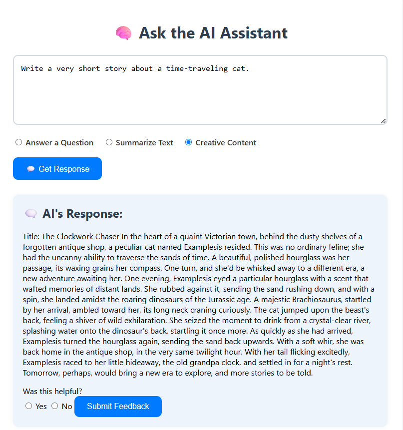

# 🧠 Smart AI Assistant

A powerful yet simple AI Assistant built with **Python (Flask)** and **OpenRouter API**, capable of answering factual questions, summarizing text, and generating creative content — all from a clean and modern web interface.

---

## 🚀 Features

- ✅ **Answer factual questions** with clarity
- ✅ **Summarize paragraphs or notes**
- ✅ **Generate creative content** (stories, poems, etc.)
- ✅ **Collect user feedback** for continuous improvement
- ✅ **Clean, mobile-friendly frontend**
- ✅ **No paid OpenAI API needed** — uses free models via [OpenRouter.ai](https://openrouter.ai)

---

## 🛠️ Built With

| Technology      | Purpose                         |
|-----------------|----------------------------------|
| Flask           | Backend web framework           |
| HTML/CSS        | Frontend UI                     |
| Python `requests` | API communication             |
| `python-dotenv` | Load API key from `.env` file   |
| OpenRouter API  | Access GPT-based models (free)  |

---

## 🖼 Screenshots

### 🌐 Answer the Questions : - 
> Ask your query and choose answer questions type

### 🤖 Summarize Text  
> Write a Paragraph and choose Summarize text Option

### ✅ Creative Content  
> Generate a creative using Creative Content option.  

✨ Future Scope
🗃️ Chat history display

🧠 Switch between multiple models (Claude, GPT-4, LLaMA-3)

📤 Ask questions from PDF files

🌐 Live web search (SerpAPI or Google API)

🔊 Voice input/output

🙌 Acknowledgements
    OpenRouter.ai

    Flask

    Free & Open-Source Community

📜 License
    This project is licensed under the MIT License — feel free to use and modify it!

